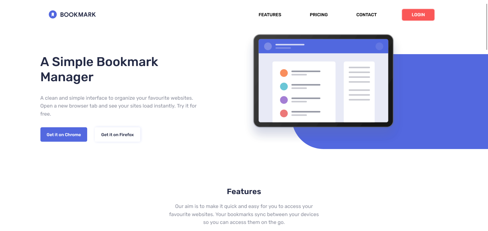

<h1 align="center"> Bookmark Website</h1>



Essa é a solução do desafio [Bookmark Landing Page do Frotend Mentor](https://www.frontendmentor.io/challenges/bookmark-landing-page-5d0b588a9edda32581d29158). Os desafios do [Frontend Mentor](https://www.frontendmentor.io/home) ajudam você a melhorar as habilidades de codificação através da construção de projetos realistas. 
 

## Índice

- [Visão geral](#visão-geral)
   - [O desafio](#o-desafio)
   - [Links](#links)
- [Meu processo](#meu-processo)
   - [Construído com](#construído-com)
   - [O que aprendi](#o-que-aprendi)
   - [Recursos úteis](#recursos-úteis)
- [Contato](#contato)
  - [Avaliação](#avaliação)


## Visão Geral

### O desafio

Os usuários devem ser capazes de:

- Ver o layout ideal para a interface dependendo do tamanho da tela do dispositivo
- Receber uma mensagem de erro quando o formulário da newsletter for enviado se:
    - O campo de entrada está vazio
    - O endereço de e-mail não está formatado corretamente


### Links 🛜

- Solução URL: [Resposta](https://github.com/tatyanepgoncalves/Bookmark-website)
- Live Site URL: [Site Ativo](https://tatyanepgoncalves.github.io/Bookmark-website/)

## Meu processo

### Construído com ⚒️

- Marcação HTML5 semântica
- Propriedades personalizadas CSS
- Caixa flexível
- Grade CSS
- Fluxo de trabalho voltado para dispositivos móveis
- JavaScript
- Font Awesome


### O que aprendi

Aprendi a como colocar formas de fundo com CSS.
````css
.simple-img{
    background-color: var(--soft-blue);
    border-radius: 0 0 0 100px;
    width: 50%;
    height: 300px;
    position: relative;
}

.simple-img img{
    width: 500px;
    position: absolute;
    top: -70px;
    left: -150px;
} 
```
Usar JS de forma dinâmica com textos e imagens
```
```js
function ActiveTab(index){
    document.getElementById("tab1Content").style.display = "none";
    document.getElementById("tab2Content").style.display = "none";
    document.getElementById("tab3Content").style.display = "none";

    document.getElementById("tab" + index + "Content").style.display = "flex";
}
```


### Recursos Úteis

- [W3schools](https://www.w3schools.com/) - Site que usar para buscar dicas de tags e instruções para que consiga o resultado esperado. 
- [MDN Web Docs](https://developer.mozilla.org/pt-BR/) - Site da Mozzila que possui documentação de tecnologias de plataforma Web e que fornece um amplo conjunto de recursos de aprendizagem para desenvolvedores iniciantes. 
- [Font Awesome](https://fontawesome.com/) - Conjunto de ferramentas de fontes e ícones.


## Contato


- Frontend Mentor - [@tatyanepgoncalves](https://www.frontendmentor.io/profile/tatyanepgoncalves)
- GitHub - [@tatyanepgoncalves](https://github.com/tatyanepgoncalves)
- LinkedIn - [@tatyanepgoncalves](https://www.linkedin.com/in/tatyanegoncalves/)

### Avaliação
De uma ⭐ se gostou desse projeto. 